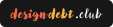
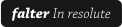

# Focus for Trello

An browser plugin that modifies [Trello](https://trello.com/)'s design to enable better focus.

Focus for Trello adds a set of styling options that you can apply as easily cycle-able presets so that you can emphasise and de-emphasis the cards and lists of your Trello board that suit your current focus.

## 🛠️ Usage
This plugin isn't yet launched. It will appear in the Chrome plugin store when available.
Follow at <a href="https://twitter.com/daledesilva" target="_blank_">@daledesilva</a> for updates.

---

## ❤️ Support
If you find this plugin saves you time or helps you in some way, please consider supporting my development of plugins and other free community material like this. A simply way is to follow and message me on twitter at [@daledesilva](https://twitter.com/daledesilva) or Mastadon at [indieweb.social/@daledesilva](https://indieweb.social/@daledesilva), and you can also support with a donation below.

  
  
  

## 🤖 My other work
You can find links to my other projects on [designdebt.club](https://designdebt.club), where I blog about design and development, as well as release other plugins like this one. You can also find my writing at at [falterinresolute.com](https://falterinresolute.com) where I combine philosophy and animation.

  
  

---

### How to contribute
- Clone this repo.
- `npm i` to install dependencies
- `npm run dev` to start compilation in watch mode.
- Copy the `dist` folder to your vault's plugins folder, or read the instructions inside `src/static/.hotreload/`
